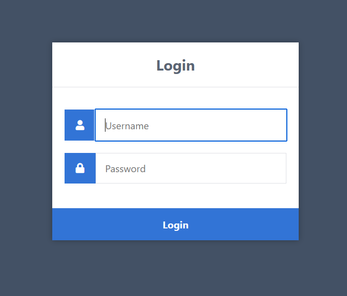
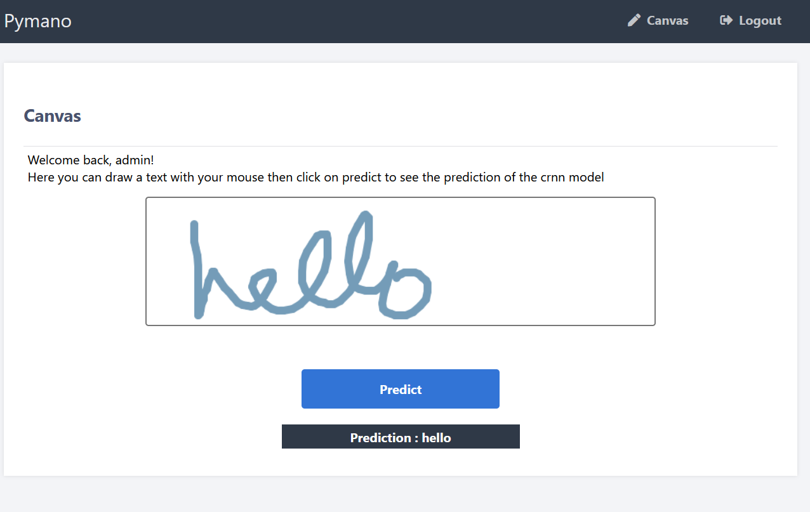

# Pymano - MLE
Welcome to my project for the Machine Learning Engineer course from Datascientest. 
The objective is to put the Pymano project into production. 
The final product should contain:
- an API that can call the model(s)
- a set of tests
- a basic authentication system
- a docker-compose.yml file that allow to runs the project(s) and the tests
- deployment files to deploy the project(s) with Kubernetes
- a documentation about the project

## What is Pymano ?
Pymano is the project of the Datascience course from Datascientest whose objective is to build a model that can recognize a word written by hand. 
We made some reasearch on Deep Learning Models that can perform this task. 
The best model we got was a Convolutional Recurrent Neural Network model (CRNN). 
This model is able to recognize one word with a Character Error Rate (CER) of 8% on the test set. However as you may experience it on the application, it's less accurate on a word drawn on an HTML canvas. 
<i>More information about the CER: [CER introduction](https://torchmetrics.readthedocs.io/en/stable/text/char_error_rate.html)</i>

## What is Pymano - MLE
Pymano-MLE is a web application that allow any user to test the model.  
First, he has to login: 
  
After a successful login, the user access to the canvas page where he can draw a word with his mouse and get the prediction by clicking on "Predict" 
 

## How to test it ?
First, there are some useful commands in the <b>commands.txt</b> file from <b>deploy</b> folder. 
Then, there are 3 ways to test it. You can:
- Use the commands in the commands.txt file to run the web and api project locally
    - Useful for developing new features and debugging the code
- Use the docker-compose file from the deploy folder. 
    - Useful to see if container are working well together and to run tests
    - You'll have to change IPVM with the IP of the device that runs the projects.
- Use the pymano-mle-... yml files to deploy the project on Kubernetes. If you need some guidances there are some commands to run in the commands.txt file. 
    - Useful to deploy the whole project
    - You'll have to change :
        - IPVM with the IP of the device that runs the projects in the deployment file
        - IPINGRESS with the IP of the ingress

There are 3 users :
- admin (password: admin)
- bob (password: password)
- sophie (password: azerty)

## Project structure
There are 4 sub-project:
- web : a Flask application that is in charge of the UI
- api : a python project that handle the business logic 
- sql : a mysql project that handle users storage
- tests : a python project that contains tests of the api (only login and prediction for now)

## Choices justifications
### philosophy
- I followed the Minimum Viable Product (MVP) approach. 
I prefer finishing a simple product with the minimum features first. 
Then I add some improvements according to the development time left. 
This approach ensure me that I will always have something to deliver. 
Here is the history of my project:
    - First version
        - build an api than can predict the word from an image of a word
        - add test for the prediction function
        - add a web app that allow to draw a word
        - build Docker container and the docker-compose file
        - deploy the project via Kubernetes
    - Second version
        - add a login page (required for the project) with hard-coded users in the python code
        - add tests for login 
        - add JWT based authentication and rewrite the test for login
        - update the docker containers, docker-compose file and yml files
    - Third version
        - add a mysql database for users
        - update the docker containers, docker-compose file and yml files
        - write the readme

<i>More information about MVP: [MVP Introduction](https://learn.marsdd.com/article/product-development-minimum-viable-product-mvp-approach/)</i>
### business
- Even if I have several models available, only the CRNN one has good enough results. To simplify user experience, I chose to deploy only the CRNN as other models didn't have a sufficient accuracy to be worth displaying and might confuse the users.
### web
- I chose to use Flask instead of a more advanced framework because the web app is only made of 2 screens. It allows me to have the same framework as the api, and saves me development time
- I chose a Josen Web Token (JWT) based authentication to add some security on the app.
 <i>More information about the JWT: [JWT introduction](https://supertokens.com/blog/what-is-jwt)</i>
### sql
- I chose mysql because it's very simple to setup.
### api
- For segmentation purpose I chose to separate the <b>UI</b> from the <b>business</b>. To do so, i created an api project that only handle the business logic. If tomorrow I want to try Django or React framework, it won't have any development cost on the business logic.
### tests
- I could have used unittest or pytest for my tests but it would take me too much time to use it with Docker so that tests returns a file.
- Also, it was required to add tests on the project, but in the case of Pymano, there is not much stuff to test. That's why I put my effort on the other parts of the project.
- I chose to separate the test project from the api project to separate concerns. For example, if I want to revamp completly the api code without changing the endpoints, I won't have to change any tests.
### git
- I chose to put all code in a single git repository because there are not too much code and I'm the only one working on the project. For a much bigger project and in a team, I would have created a separate git repository for each project 

## Improvements
- Use pytest or unittest for tests
- Add a new screen allowing the user to take a picture of a word and send it to the model
- Trigger a build and run tests as soon as code are pushed on the main branch
- Find a better model that can predict a sentence or even a whole document
- Ensure that the web application can run well on mobile devices
- Add a user registration screen